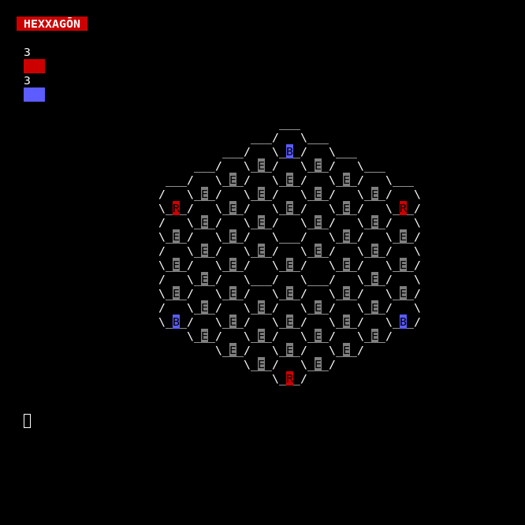
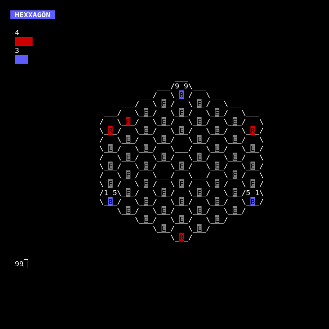
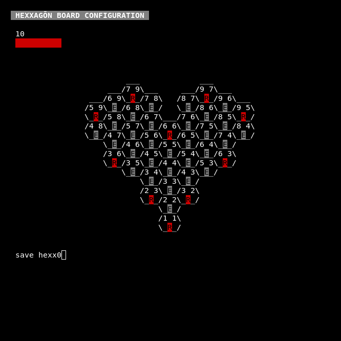
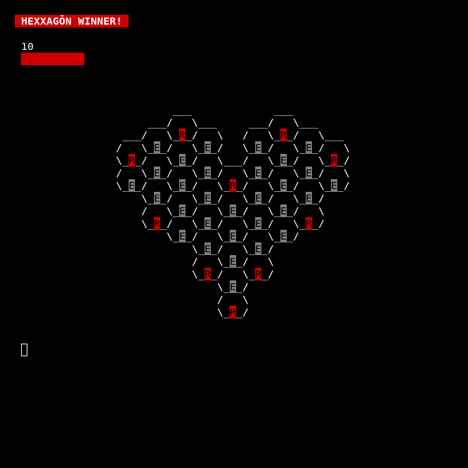

# Hexxagōn

A Hexxagōn clone written in Haskell. History of the game can be found on the [Ataxx](https://en.wikipedia.org/wiki/Ataxx) Wikipedia page.

---

There are two executables, hexxagon and hexxBoardConfig.

Launching hexxagon will show the default board.

Red is always first, press enter to show the available pieces that can be moved.

Entering coordinates for a piece will show its moveset.

Choosing an adjacent space will clone the piece into that hexagon.

Blue's turn next.

Choosing a space further away will cause the peice to hop to that hexagon. 

As you can see, any opponent peices in direct proximity will convert.

The objective of the game is to either eliminate the opponent's pieces or have the most hexxagons filled on the board.

---

hexBordConfig allows for custom board creations.

Use the coordinates to specify hexagons to delete or change them to red, blue or empty spaces.

When finished, save the layout to a file.

This can then be loaded into the main game.

Red wins here since there's no contest.

At any time and in either mode the players can "load", "save" or "quit" the game. Shortcuts to these commands are also available with the initials (for example 'l', 's' and 'q').

Possible todos:
* Random board configurations
* Network play
* AI opponent

---

Special thanks to [Mazen-Khaddaj](https://github.com/Dr-Mazen-Khaddaj) who collaborated with me, helping improve the design of my original rough draft and providing the Instances and UtilityFxs modules. He will be bringing this to the next level as part of a project for the Cardano blockchain, with the idea being to play the game over the blockchain to allow competitive wagers.
